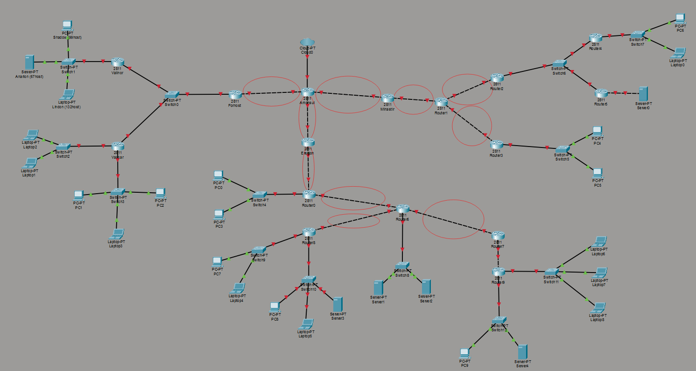
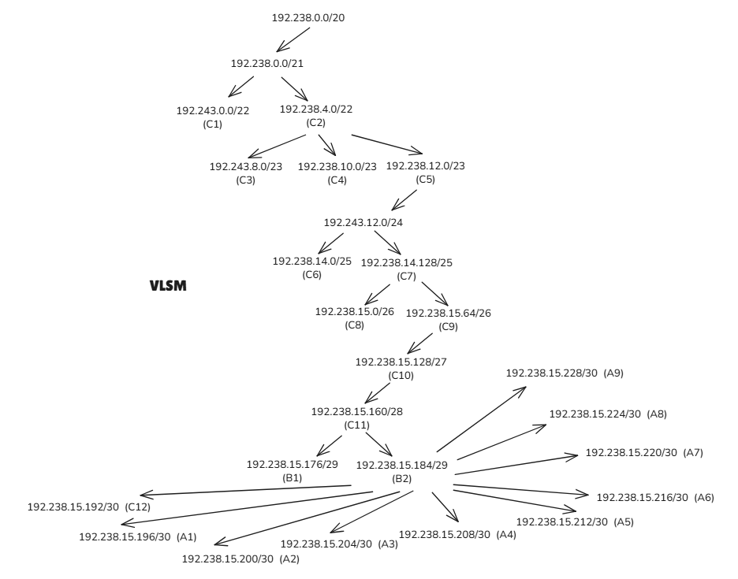

# Jarkom-Modul-4-2025-K54

| No | Nama                              | NRP         |
|----|-----------------------------------|-------------|
| 1  | Salsa Bil Ulla         | 5027241052 |
| 2  | Hafiz Ramadhan   | 5027241096  |

## VLSM

## CIDR

### Pembagian IP – CIDR
| Subnet | Network ID | Netmask | Broadcast | Usable IP Range |
|--------|------------|----------|------------|------------------|
| A10 | 192.238.0.0 | 255.255.252.0 | 192.238.3.255 | 192.238.0.1 - 192.238.3.254 |
| A22 | 192.238.4.0 | 255.255.252.0 | 192.238.7.255 | 192.238.4.1 - 192.238.7.254 |
| A11 | 192.238.8.0 | 255.255.254.0 | 192.238.9.255 | 192.238.8.1 - 192.238.9.254 |
| A12 | 192.238.10.0 | 255.255.254.0 | 192.238.11.255 | 192.238.10.1 - 192.238.11.254 |
| A1 | 192.238.12.0 | 255.255.254.0 | 192.238.13.255 | 192.238.12.1 - 192.238.13.254 |
| A7 | 192.238.14.0 | 255.255.255.128 | 192.238.14.127 | 192.238.14.1 - 192.238.14.126 |
| A8 | 192.238.14.128 | 255.255.255.128 | 192.238.14.255 | 192.238.14.129 - 192.238.14.254 |
| A20 | 192.238.15.0 | 255.255.255.192 | 192.238.15.63 | 192.238.15.1 - 192.238.15.62 |
| A3 | 192.238.15.64 | 255.255.255.192 | 192.238.15.127 | 192.238.15.65 - 192.238.15.126 |
| A2 | 192.238.15.128 | 255.255.255.224 | 192.238.15.159 | 192.238.15.129 - 192.238.15.158 |
| A9 | 192.238.15.160 | 255.255.255.240 | 192.238.15.175 | 192.238.15.161 - 192.238.15.174 |
| A4 | 192.238.15.176 | 255.255.255.248 | 192.238.15.183 | 192.238.15.177 - 192.238.15.182 |
| A19 | 192.238.15.184 | 255.255.255.248 | 192.238.15.191 | 192.238.15.185 - 192.238.15.190 |
| A21 | 192.238.15.192 | 255.255.255.248 | 192.238.15.199 | 192.238.15.193 - 192.238.15.198 |
| A5 | 192.238.15.200 | 255.255.255.252 | 192.238.15.203 | 192.238.15.201 - 192.238.15.202 |
| A6 | 192.238.15.204 | 255.255.255.252 | 192.238.15.207 | 192.238.15.205 - 192.238.15.206 |
| A13 | 192.238.15.208 | 255.255.255.252 | 192.238.15.211 | 192.238.15.209 - 192.238.15.210 |
| A14 | 192.238.15.212 | 255.255.255.252 | 192.238.15.215 | 192.238.15.213 - 192.238.15.214 |
| A15 | 192.238.15.216 | 255.255.255.252 | 192.238.15.219 | 192.238.15.217 - 192.238.15.218 |
| A16 | 192.238.15.220 | 255.255.255.252 | 192.238.15.223 | 192.238.15.221 - 192.238.15.222 |
| A17 | 192.238.15.224 | 255.255.255.252 | 192.238.15.227 | 192.238.15.225 - 192.238.15.226 |
| A18 | 192.238.15.228 | 255.255.255.252 | 192.238.15.231 | 192.238.15.229 - 192.238.15.230 |

### Penggabungan – CIDR

#### I
| Subnet | Subnet 1 | Netmask 1 | Subnet 2 | Netmask 2 | Netmask Akhir |
|--------|----------|-----------|----------|-----------|---------------|
| B1 | A1 | /23 | A2 | /27 | /22 |
| B2 | A3 | /26 | A4 | /29 | /25 |
| B3 | A5 | /30 | A6 | /30 | /29 |
| B4 | A7 | /25 | A8 | /25 | /24 |
| B5 | A9 | /28 | A10 | /22 | /21 |
| B6 | A11 | /23 | A12 | /23 | /22 |
| B7 | A13 | /30 | A14 | /30 | /29 |
| B8 | A15 | /30 | A16 | /30 | /29 |
| B9 | A17 | /30 | A18 | /30 | /29 |
| B10 | A19 | /29 | A20 | /26 | /25 |
| B11 | A21 | /29 | A22 | /22 | /21 |
| B12 | A23 | /30 | - | - | /30 |

#### II
| Subnet | Subnet 1 | Netmask 1 | Subnet 2 | Netmask 2 | Netmask Akhir |
|--------|----------|-----------|----------|-----------|---------------|
| C1 | B1 | /22 | B2 | /25 | /21 |
| C2 | B3 | /29 | B4 | /24 | /23 |
| C3 | B5 | /21 | B6 | /22 | /20 |
| C4 | B7 | /29 | B8 | /29 | /28 |
| C5 | B9 | /29 | B10 | /25 | /24 |
| C6 | B11 | /21 | B12 | /30 | /20 |

#### III
| Subnet | Subnet 1 | Netmask 1 | Subnet 2 | Netmask 2 | Netmask Akhir |
|--------|----------|-----------|----------|-----------|---------------|
| D1 | C1 | /21 | C2 | /23 | /20 |
| D2 | C3 | /20 | C4 | /28 | /19 |
| D3 | C5 | /24 | C6 | /20 | /19 |

#### IV
| Subnet | Subnet 1 | Netmask 1 | Subnet 2 | Netmask 2 | Netmask Akhir |
|--------|----------|-----------|----------|-----------|---------------|
| E1 | D1 | /20 | D2 | /19 | /18 |
| E2 | D3 | /19 | - | - | /19 |

#### V
| Subnet | Subnet 1 | Netmask 1 | Subnet 2 | Netmask 2 | Netmask Akhir |
|--------|----------|-----------|----------|-----------|---------------|
| F1 | E1 | /18 | E2 | /19 | /17 |
